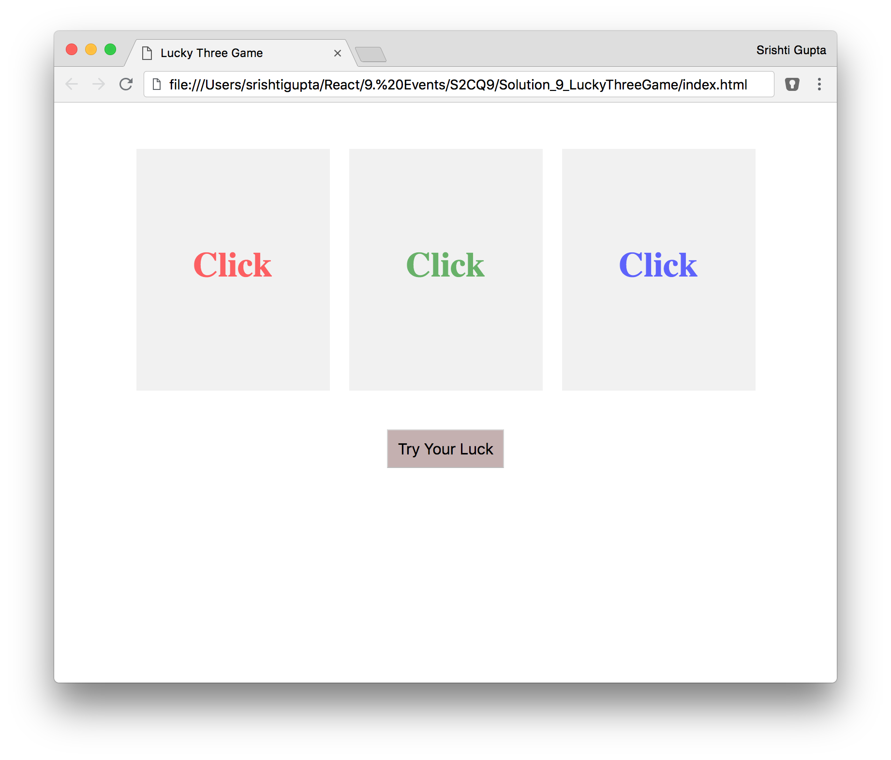
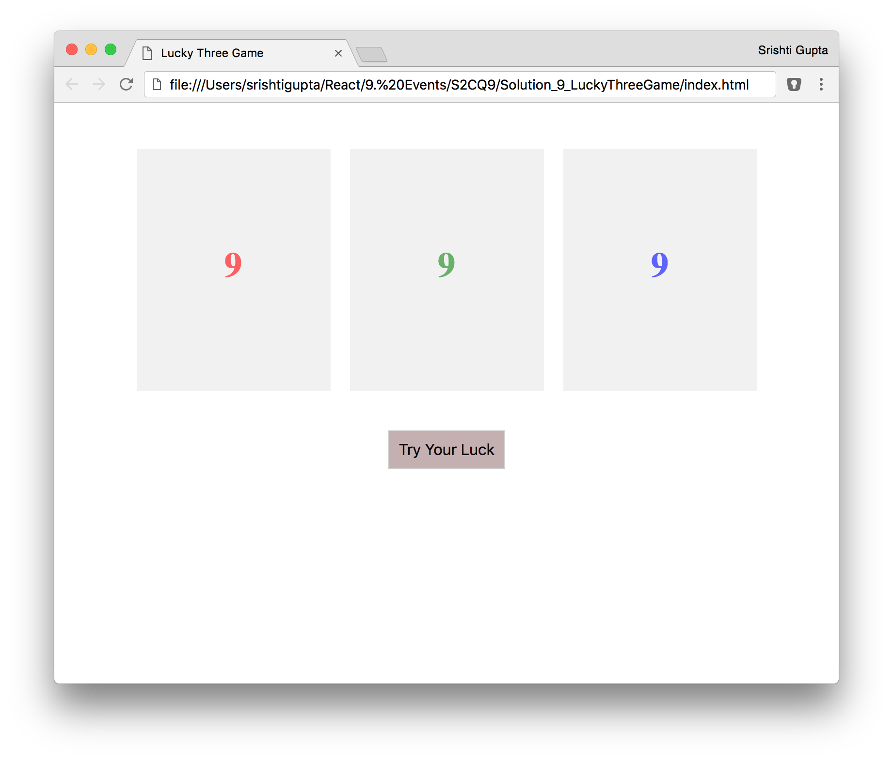
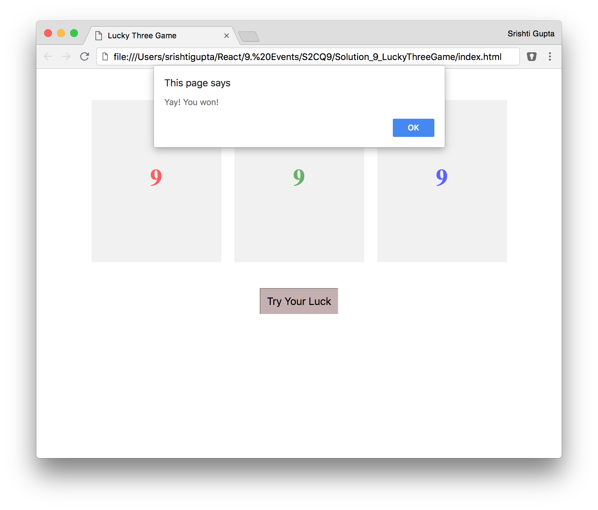

# react_assignment4
Lucky Three Game React Assignment 4

You are getting bored and you decide to build a game that tests your luck. There are three cards which display “Click” initially.

When you click on a card, it starts displaying random numbers between 0 and 9. One by one, you click on all three cards and all of them start displaying random numbers.

There is a button with text “Try Your Luck”. When this button is clicked, all the cards stop displaying random numbers. In case all the numbers on the cards are same, an alert is displayed with the message “Yay! You won!” otherwise the message “Ohh! You lost!” is displayed.

